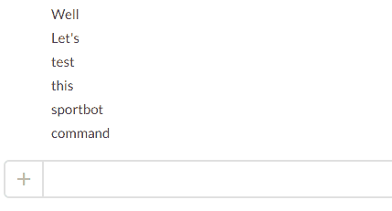

.. Sportbot documentation master file, created by
   sphinx-quickstart on Tue Jul 12 18:53:06 2016.
   You can adapt this file completely to your liking, but it should at least
   contain the root `toctree` directive.

Welcome to Sportbot's documentation!
====================================

**Sportbot** provides live scores and fixtures of the day for all American major leagues, European football leagues and tennis

You can either use commands or invite the bot to your Slack team.

Have fun with Sportbot!

.. _user_documentation:

.. toctree::
	:maxdepth: 2
	:caption: User Documentation
	
	getting_started
	commands
	bot

	